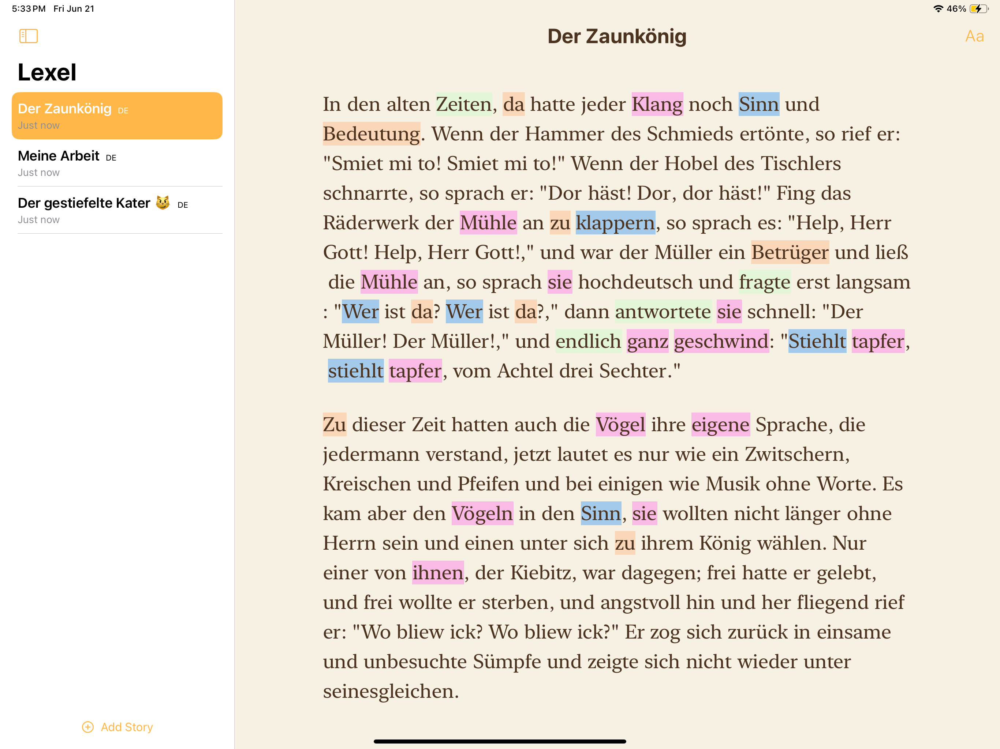
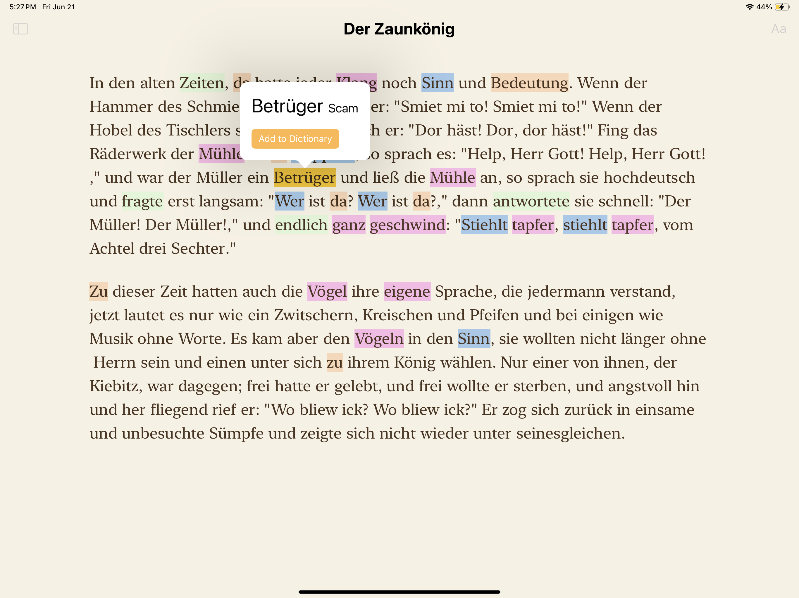
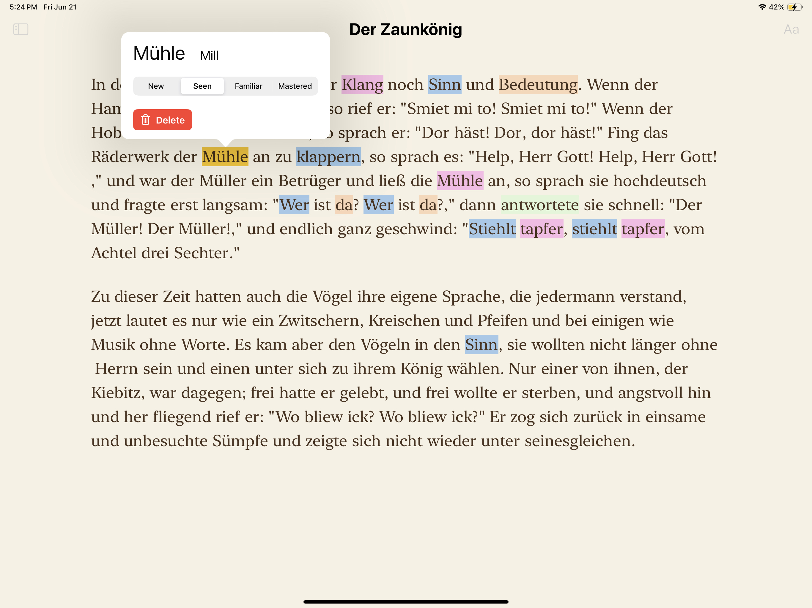

# Lexel

Lexel is an upcoming language learning app that lets you learn a language by reading things you care about.

Keep track of all the words you've learned and how familiar you are with them. Each word you have added will be highlighted based on its familiarity level

